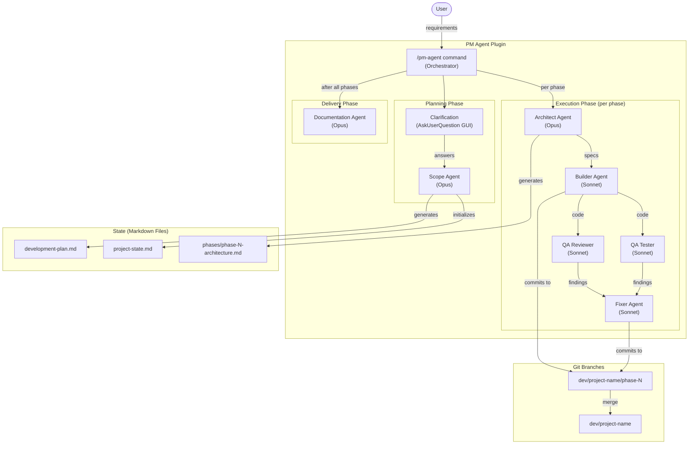
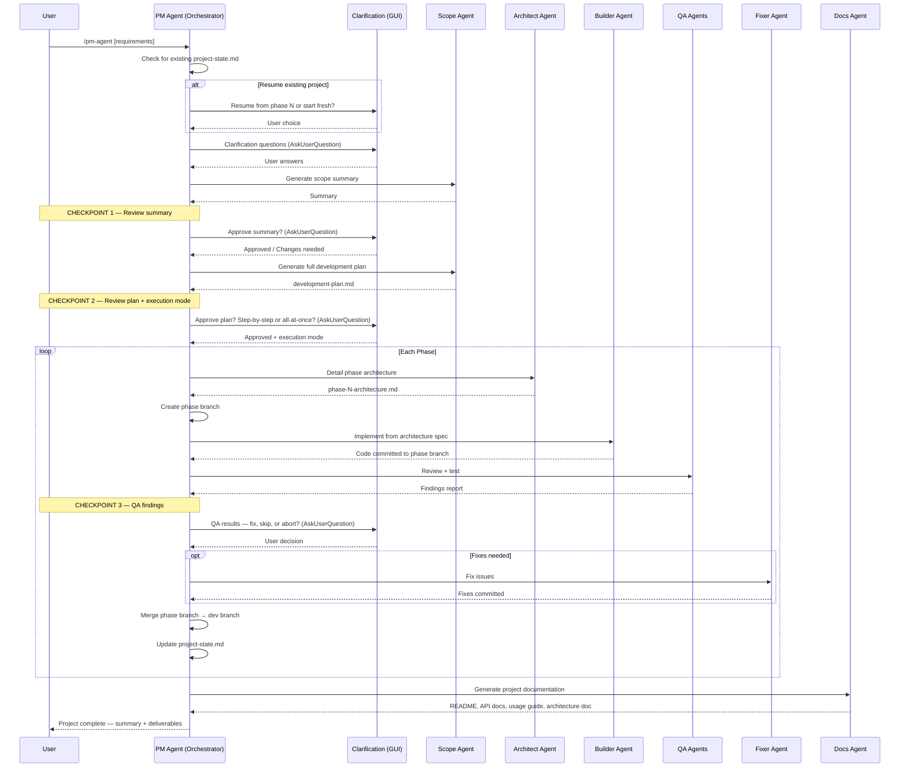
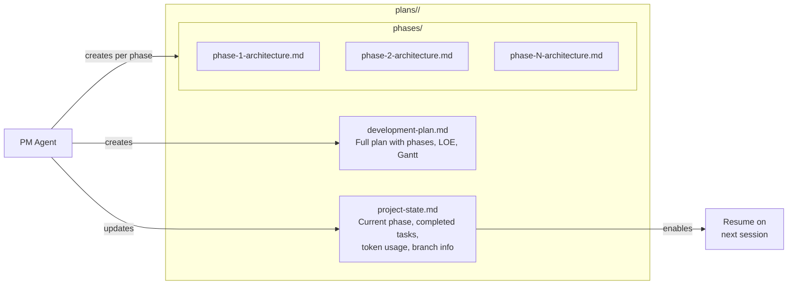
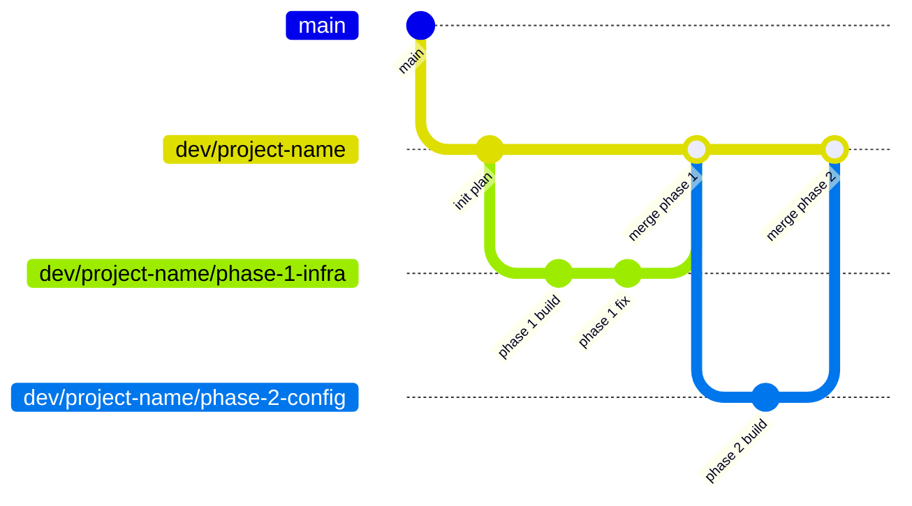
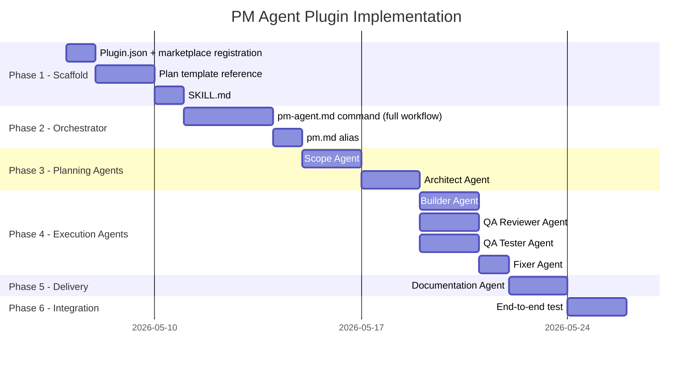

# PM Agent — Development Plan

## 1. Overview

A Project Manager (PM) Agent plugin for Claude Code that orchestrates complex software project development using a team of specialized sub-agents. The PM Agent receives requirements from the user, creates a structured development plan, and coordinates execution through Scope, Architecture, Builder, QA, Fixer, and Documentation agents — each assigned an optimal model based on task complexity. The plugin is designed for general-purpose use across any project.

---

## 2. User Requirements

- **Multi-agent orchestration**: Build a PM Agent that coordinates a team of specialized sub-agents to plan and deliver complex software systems
- **Scope agent**: Receives user requirements and generates a comprehensive development plan following a standardized template (overview, requirements, architecture, implementation plan with Gantt charts, LOE estimates, etc.)
- **Clarification agent**: Uses the `AskUserQuestion` GUI to interactively gather missing information from the user with single/multiple-choice option menus
- **Architecture agent**: Takes each phase from the plan and produces detailed specifications (modules, functions, interfaces, data flows)
- **Builder agent**: Implements code based on architecture specs, working on isolated git branches per phase
- **QA agents**: Separate agents for static code review and test execution
- **Fixer agent**: Receives QA findings and applies targeted fixes
- **Documentation agent**: Generates full project documentation (README, API reference, usage guide, architecture doc) after all phases complete
- **Checkpoints**: Three mandatory user-approval gates: (1) after scope summary, (2) after full plan generation (with step-by-step vs. all-at-once execution choice), (3) after QA results
- **State persistence**: Maintain project state in markdown files (committable to git) enabling resume across sessions and machines
- **Git branching**: Create a development branch per project with sub-branches per phase
- **Configurable plan directory**: Ask the user where to save plans, defaulting to `plans/`
- **Resume capability**: Detect existing project state and offer to continue from where the agent left off
- **Cost tracking**: Log actual tokens used vs. estimated per phase
- **Model assignment**: Each agent uses the optimal model (Opus for deep thinking, Sonnet for execution)
- **Claude Code plugin**: Implement as a Claude Code custom plugin in the acc-toolbox marketplace

---

## 3. Project Status

- [ ] Plugin scaffold (plugin.json, command files)
- [ ] Scope Agent
- [ ] Architect Agent
- [ ] Builder Agent
- [ ] QA Reviewer Agent
- [ ] QA Tester Agent
- [ ] Fixer Agent
- [ ] Documentation Agent
- [ ] Plan template reference file
- [ ] SKILL.md
- [ ] Marketplace registration
- [ ] End-to-end test

---

## 4. Architecture

### System Architecture



### Orchestrator Workflow



### State Management



---

## 5. Core Components

### 5.1 PM Agent Orchestrator (Command)

**File**: `commands/pm-agent.md`

The main command that coordinates all sub-agents. Implements the 6-phase workflow with 3 checkpoints. Responsible for:
- Detecting existing project state (resume capability)
- Dispatching sub-agents in the correct order
- Managing git branches (create, switch, merge)
- Enforcing checkpoints via `AskUserQuestion`
- Updating project state after each phase
- Tracking token usage vs. estimates

### 5.2 Scope Agent

**File**: `agents/scope-agent.md` | **Model**: Opus

Receives user requirements and produces:
1. A concise project summary (for Checkpoint 1)
2. A full development plan markdown document following the standardized template

The plan template includes: Overview, User Requirements, Project Status, Architecture (Mermaid diagrams), Core Components, Infrastructure, Project Structure, Implementation Plan (Gantt chart + LOE table with token estimates and model assignments), Key Design Decisions, Environment Variables, Evaluation & Success Criteria.

Uses `references/plan-template.md` as the structural template.

### 5.3 Architect Agent

**File**: `agents/architect-agent.md` | **Model**: Opus

Takes a single phase from the development plan and produces a detailed architecture document:
- Module and file specifications
- Function signatures with type hints
- Data flow diagrams (Mermaid)
- Interface contracts between components
- Error handling strategy
- Dependencies and imports

Output saved to `plans/<project-name>/phases/phase-N-architecture.md`.

### 5.4 Builder Agent

**File**: `agents/builder-agent.md` | **Model**: Sonnet

Receives the phase architecture document and implements the code:
- Creates/modifies files according to the architecture spec
- Follows project conventions (detected from existing code)
- Commits work to the phase branch
- Reports what was built and any deviations from the spec

### 5.5 QA Reviewer Agent

**File**: `agents/qa-reviewer.md` | **Model**: Sonnet

Static code review of the builder's output:
- Code quality, readability, DRY principles
- Security vulnerabilities (OWASP top 10)
- Adherence to project conventions
- Adherence to the architecture spec
- Logic errors and edge cases

Output: structured findings table with severity levels (critical / warning / note).

### 5.6 QA Tester Agent

**File**: `agents/qa-tester.md` | **Model**: Sonnet

Executes tests and checks on the builder's output:
- Runs existing test suites (`pytest`)
- Runs linting (`ruff`)
- Runs type checking if configured
- Verifies test checkpoints defined in the development plan
- Reports pass/fail with details

### 5.7 Fixer Agent

**File**: `agents/fixer-agent.md` | **Model**: Sonnet

Receives QA findings and applies targeted fixes:
- Reads the specific issues from both QA agents
- Applies minimal, focused fixes
- Commits fixes to the same phase branch
- Does not refactor beyond what's needed to resolve the issue

### 5.8 Documentation Agent

**File**: `agents/docs-agent.md` | **Model**: Opus

Generates comprehensive project documentation after all phases are complete:
- **README.md**: Project overview, setup instructions, usage examples, architecture diagram
- **API Reference**: Auto-generated from code docstrings and function signatures
- **Usage Guide**: Step-by-step guide for common workflows
- **Architecture Doc**: System design, component interactions, data flows

Reads the development plan, architecture docs, and implemented code to produce accurate documentation.

### 5.9 Plan Template

**File**: `skills/pm-agent/references/plan-template.md`

The standardized markdown template that the Scope Agent uses to generate development plans. Defines the exact section structure, Mermaid diagram formats, LOE table format, and Gantt chart template. Ensures consistency across all projects.

---

## 6. Infrastructure

### 6.1 Plugin Registration

**File**: `plugins/pm-agent/.claude-plugin/plugin.json`

```json
{
    "name": "pm-agent",
    "version": "0.1.0",
    "description": "Project Manager Agent. Orchestrates complex software project development using specialized sub-agents for scoping, architecture, building, QA, fixing, and documentation.",
    "author": {
        "name": "Rami Krispin"
    }
}
```

**Marketplace registration**: Add entry to `acc-toolbox/.claude-plugin/marketplace.json`.

### 6.2 State File Format

**project-state.md**:
```markdown
---
project: <project-name>
plan_dir: plans/<project-name>
dev_branch: dev/<project-name>
current_phase: 3
total_phases: 8
status: in_progress
created: 2026-05-07
updated: 2026-05-09
---

## Completed Phases

| Phase | Name | Branch | Status | Est. Tokens | Actual Tokens |
|-------|------|--------|--------|-------------|---------------|
| 1 | Infrastructure | dev/my-project/phase-1-infra | merged | ~5K | 4.2K |
| 2 | Config System | dev/my-project/phase-2-config | merged | ~9K | 8.7K |

## Current Phase

Phase 3: Ingestion Pipeline — in progress (step 3.2 of 3.5)

## Pending Phases

- Phase 4: Retrieval & Generation
- Phase 5: FastAPI Service
...
```

### 6.3 Git Branch Strategy



---

## 7. Project Structure

```
acc-toolbox/plugins/pm-agent/
├── .claude-plugin/
│   └── plugin.json                 # Plugin metadata and version
├── commands/
│   ├── pm-agent.md                 # Main orchestrator command (full workflow)
│   └── pm.md                       # Short alias → same content
├── agents/
│   ├── scope-agent.md              # Development plan generation (Opus)
│   ├── architect-agent.md          # Phase-level architecture detail (Opus)
│   ├── builder-agent.md            # Code implementation (Sonnet)
│   ├── qa-reviewer.md              # Static code review (Sonnet)
│   ├── qa-tester.md                # Test execution + linting (Sonnet)
│   ├── fixer-agent.md              # Fix QA findings (Sonnet)
│   └── docs-agent.md               # Project documentation (Opus)
└── skills/
    └── pm-agent/
        ├── SKILL.md                # Plugin overview, usage, agent index
        └── references/
            └── plan-template.md    # Standardized development plan template
```

---

## 8. Implementation Plan

### Phase Overview



### Level of Effort Estimate (LLM-Assisted Implementation)

| Phase | Component | Complexity | Est. Tokens | Model | Agent | Rationale |
|-------|-----------|------------|-------------|-------|-------|-----------|
| **1 - Scaffold** | plugin.json + marketplace.json | Low | ~1K | Sonnet | — | Boilerplate JSON, follow existing pattern |
| | Plan template reference | Medium | ~6K | Opus | — | Critical template defining plan structure, Mermaid formats, LOE table format |
| | SKILL.md | Low | ~3K | Sonnet | — | Plugin overview, follows existing SKILL.md pattern |
| | **Phase 1 subtotal** | | **~10K** | | | |
| **2 - Orchestrator** | pm-agent.md command | High | ~15K | Opus | — | Complex workflow orchestration, 6 phases, 3 checkpoints, state management, resume logic, branching |
| | pm.md alias | Low | ~1K | Sonnet | — | Short alias referencing main command |
| | **Phase 2 subtotal** | | **~16K** | | | |
| **3 - Planning Agents** | Scope Agent | High | ~10K | Opus | Scope | Generates comprehensive development plans, uses template, produces Mermaid diagrams + LOE tables |
| | Architect Agent | High | ~8K | Opus | Architect | Detailed phase architecture with module specs, function signatures, data flows |
| | **Phase 3 subtotal** | | **~18K** | | | |
| **4 - Execution Agents** | Builder Agent | Medium | ~6K | Sonnet | Builder | Code generation from specs, follows conventions, commits to branches |
| | QA Reviewer Agent | Medium | ~6K | Sonnet | QA Reviewer | Structured review checklist, severity classification, findings table |
| | QA Tester Agent | Medium | ~5K | Sonnet | QA Tester | Test execution, lint, type check; report format |
| | Fixer Agent | Low | ~4K | Sonnet | Fixer | Targeted fixes from QA findings, minimal scope |
| | **Phase 4 subtotal** | | **~21K** | | | |
| **5 - Delivery** | Documentation Agent | Medium | ~8K | Opus | Docs | Full project docs from code + plan; README, API ref, usage guide, arch doc |
| | **Phase 5 subtotal** | | **~8K** | | | |
| **6 - Integration** | End-to-end test | Medium | ~5K | Opus | — | Test full workflow on a sample project |
| | **Phase 6 subtotal** | | **~5K** | | | |
| | | | | | | |
| **Total** | All phases | | **~78K** | | | |

> **Model selection guide**:
> - **Opus** — Orchestrator command, scope agent, architect agent, docs agent, plan template, and end-to-end test. These require deep reasoning, architectural decisions, or synthesis of complex context.
> - **Sonnet** — Builder, QA reviewer, QA tester, fixer, SKILL.md, alias command, plugin scaffold. These are well-defined tasks with clear input/output contracts.
>
> **Token estimates** reflect output tokens. Input context (file reads, instructions, plan content) adds ~2-3x on top.

---

## 9. Key Design Decisions

| Decision | Choice | Rationale |
|----------|--------|-----------|
| Plugin format | Claude Code custom plugin | General-purpose, works across projects, distributable via marketplace |
| State persistence | Markdown files in plans/ | Git-committable, portable across machines, human-readable |
| Branching | dev/project/phase-N | Isolates work per phase, enables rollback, clean PR history |
| Clarification UI | AskUserQuestion tool | Native Claude Code GUI with single/multi-select option menus |
| Plan template | Reference markdown file | Ensures consistency across all projects; scope agent follows it exactly |
| QA separation | Two agents (reviewer + tester) | Static analysis and test execution are independent concerns |
| Docs timing | After all phases | Ensures documentation reflects final implemented code |
| Model assignment | Opus for thinking, Sonnet for execution | Optimal cost/quality tradeoff per agent role |
| Resume mechanism | project-state.md frontmatter | YAML frontmatter with current_phase, status; orchestrator reads on startup |
| Plan directory | User-configurable, default plans/ | AskUserQuestion at project start |

---

## 10. Agent Model Assignments

| Agent | Model | Color | Tools | Justification |
|-------|-------|-------|-------|---------------|
| Scope Agent | Opus | blue | Read, Grep, Glob, Bash | Deep system design, comprehensive plan generation, Mermaid diagrams |
| Architect Agent | Opus | blue | Read, Grep, Glob | Detailed module/function specs, interface design, data flow analysis |
| Builder Agent | Sonnet | green | Read, Write, Edit, Bash, Grep, Glob | Code generation from well-defined specs, follows conventions |
| QA Reviewer | Sonnet | red | Read, Grep, Glob | Static code review against architecture spec and conventions |
| QA Tester | Sonnet | red | Read, Bash, Grep, Glob | Test execution, linting, type checking — needs Bash for running tools |
| Fixer Agent | Sonnet | yellow | Read, Write, Edit, Bash, Grep, Glob | Targeted fixes, needs write access for edits |
| Docs Agent | Opus | purple | Read, Write, Grep, Glob, Bash | Synthesizes code + plan into comprehensive documentation |

---

## 11. Environment Variables

| Variable | Purpose | Required |
|----------|---------|----------|
| None | The PM Agent plugin is a pure orchestration layer — it uses the host project's environment variables. API keys for LLM providers are configured at the Claude Code level, not within the plugin. | — |

---

## 12. Evaluation & Success Criteria

### Functional Requirements

- [ ] `/pm-agent` command launches the full workflow
- [ ] `/pm` alias works identically
- [ ] Clarification questions use AskUserQuestion GUI with option menus
- [ ] Scope agent generates a complete development plan following the template
- [ ] Checkpoint 1 pauses for user summary approval
- [ ] Checkpoint 2 pauses for plan approval with execution mode choice
- [ ] Architect agent produces detailed per-phase architecture docs
- [ ] Builder agent implements code on isolated phase branches
- [ ] QA reviewer produces structured findings table
- [ ] QA tester runs tests and reports results
- [ ] Checkpoint 3 pauses with QA findings for user decision
- [ ] Fixer agent resolves QA issues when approved
- [ ] Documentation agent generates README, API docs, usage guide, architecture doc
- [ ] Phase branches are created and merged correctly

### State & Resume

- [ ] project-state.md is created and updated after each phase
- [ ] Re-invoking `/pm-agent` in an existing project detects state and offers resume
- [ ] State files are git-committable and work across machines
- [ ] Token usage is tracked and appended to project-state.md

### Quality

- [ ] Each agent has clear input/output contracts
- [ ] Agent prompts include security considerations (prompt injection defense)
- [ ] Error recovery is defined for each agent (what to do when things fail)
- [ ] The plan template produces consistent, well-structured plans across different projects
