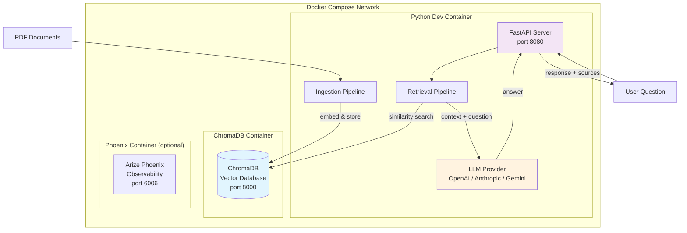
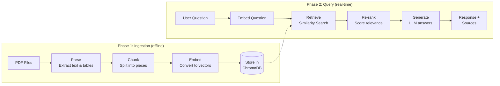

# Getting Started with RAG

A hands-on guide to Retrieval-Augmented Generation (RAG) using this project as a learning environment. By the end, you'll understand how to build a system that answers natural-language questions about PDF documents.

---

## Table of Contents

1. [What is RAG?](#1-what-is-rag)
2. [Architecture Overview](#2-architecture-overview)
3. [Workflow at a Glance](#3-workflow-at-a-glance)
4. [Deep Dive: PDF Parsing](#4-deep-dive-pdf-parsing)
5. [Deep Dive: Chunking](#5-deep-dive-chunking)
6. [Deep Dive: Embeddings](#6-deep-dive-embeddings)
7. [Deep Dive: Vector Storage (ChromaDB)](#7-deep-dive-vector-storage-chromadb)
8. [Deep Dive: Retrieval](#8-deep-dive-retrieval)
9. [Deep Dive: Re-ranking](#9-deep-dive-re-ranking)
10. [Deep Dive: Answer Generation](#10-deep-dive-answer-generation)
11. [Putting It All Together](#11-putting-it-all-together)

---

## 1. What is RAG?

**Retrieval-Augmented Generation (RAG)** is a pattern that enhances Large Language Models (LLMs) by giving them access to external knowledge at query time. Instead of relying solely on the LLM's training data (which is static and may be outdated), RAG retrieves relevant information from your own documents and feeds it to the LLM as context.

### The Problem RAG Solves

LLMs have two key limitations:

1. **Knowledge cutoff** — they only know what they were trained on.
2. **Hallucination** — they can generate plausible-sounding but incorrect answers.

RAG addresses both: it grounds the LLM's response in your actual documents, and it provides source citations so you can verify the answer.

### How RAG Works (High Level)

```
1. INGEST: Convert your documents into searchable vectors (one-time setup)
2. QUERY:  When a user asks a question:
           a. Convert the question into a vector
           b. Find the most similar document chunks
           c. Pass those chunks + the question to the LLM
           d. Return the LLM's answer with source citations
```

### RAG vs. Fine-Tuning

| Approach | Best For | Tradeoffs |
|----------|----------|-----------|
| **RAG** | Factual Q&A over specific documents | No model training needed; easy to update documents; answers are traceable to sources |
| **Fine-tuning** | Changing model behavior or style | Requires training data and compute; harder to update; no built-in citations |

This project uses RAG to answer questions about financial reports (10-Q SEC filings), but the pattern applies to any domain: legal documents, technical manuals, research papers, etc.

---

## 2. Architecture Overview

This project runs as a set of Docker containers orchestrated with Docker Compose:



### Components

| Component | Role | Technology |
|-----------|------|------------|
| **Python Dev Container** | Runs the application code — ingestion, retrieval, API | Python 3.11, FastAPI, LangChain |
| **ChromaDB** | Stores document embeddings as vectors for fast similarity search | ChromaDB 1.3.5 |
| **Phoenix** (optional) | LLM observability — traces, latency, token usage | Arize Phoenix |
| **LLM Providers** | Generate embeddings and answer questions | OpenAI, Anthropic, Gemini |

### How Containers Communicate

All containers share a Docker bridge network (`rag-docker`). The Python container connects to ChromaDB using the hostname `chromadb` on port 8000:

```python
import chromadb
client = chromadb.HttpClient(host="chromadb", port=8000)
```

---

## 3. Workflow at a Glance

The RAG process has two phases: **Ingestion** (offline, one-time per document set) and **Query** (real-time, per user question).



---

## 4. Deep Dive: PDF Parsing

The first step is extracting structured content from PDF files. This project uses [Docling](https://github.com/DS4SD/docling), which understands document layout — it can distinguish headings, paragraphs, and tables.

### What the Parser Produces

Each PDF is converted into a list of `ParsedElement` objects:

```python
@dataclass
class ParsedElement:
    content: str          # The extracted text
    type: str             # "text", "table", or "heading"
    page: int             # Page number in the PDF
    section_title: str    # The heading this content falls under
```

### Using the Parser

```python
from rag.ingestion.pdf_parser import parse_pdf

# Parse a single PDF
elements = parse_pdf("docs/10Q-Q1-2026-as-filed.pdf")

# Inspect the results
for elem in elements[:5]:
    print(f"[Page {elem.page}] [{elem.type}] {elem.content[:80]}...")
```

**Example output:**
```
[Page 1] [heading] UNITED STATES SECURITIES AND EXCHANGE COMMISSION...
[Page 1] [text] For the quarterly period ended March 29, 2026...
[Page 5] [table] | Revenue | Q1 2026 | Q1 2025 | Change |...
```

### Why This Matters for RAG

Raw PDF text extraction (e.g., with PyPDF2) loses document structure. Docling preserves:

- **Headings** — so chunks can be tagged with their section context.
- **Tables** — kept as markdown tables rather than broken into unreadable fragments.
- **Page numbers** — for source citations in answers.

---

## 5. Deep Dive: Chunking

LLMs have limited context windows, and embedding models work best on focused passages. Chunking splits parsed content into appropriately sized pieces.

### Why Not Embed Entire Documents?

1. **Embedding quality** — shorter, focused text produces more meaningful vectors.
2. **Retrieval precision** — you want to retrieve the specific paragraph that answers a question, not an entire 50-page document.
3. **Context window** — LLMs can only process a limited amount of text at once.

### Chunking Methods

This project implements three strategies:

#### Recursive (Default)

Splits text by character count with overlap, breaking at natural boundaries (paragraphs, sentences):

```python
from rag.ingestion.pdf_parser import parse_pdf
from rag.ingestion.chunker import chunk_elements

elements = parse_pdf("docs/form-10-q.pdf")

chunks = chunk_elements(
    elements,
    method="recursive",
    chunk_size=1000,      # Max characters per chunk
    chunk_overlap=200,    # Characters of overlap between chunks
    keep_tables_intact=True,
)

print(f"Total chunks: {len(chunks)}")
print(f"First chunk ({len(chunks[0].content)} chars): {chunks[0].content[:100]}...")
```

#### By Title

Groups content under each heading — chunks respect document structure:

```python
chunks = chunk_elements(elements, method="by_title")
```

#### Semantic

Accumulates adjacent paragraphs until the chunk size is reached — keeps related content together:

```python
chunks = chunk_elements(elements, method="semantic")
```

### Chunk Overlap Explained

Overlap prevents information loss at chunk boundaries. With `chunk_size=1000` and `chunk_overlap=200`:

```
Chunk 1: characters 0–1000
Chunk 2: characters 800–1800    ← 200 chars overlap with Chunk 1
Chunk 3: characters 1600–2600   ← 200 chars overlap with Chunk 2
```

This ensures that a sentence split across boundaries still appears in full in at least one chunk.

### Tables as Chunks

When `keep_tables_intact=True`, tables are never split — they become their own chunk regardless of size. This is critical for financial documents where table data must remain coherent:

```python
# A table chunk
table_chunks = [c for c in chunks if c.type == "table"]
print(table_chunks[0].content)
# | Revenue | Q1 2026 | Q1 2025 | Change |
# |---------|---------|---------|--------|
# | Products | $68.7B | $65.1B | +5.5% |
# | Services | $26.7B | $23.9B | +11.7% |
```

---

## 6. Deep Dive: Embeddings

Embeddings convert text into numerical vectors (lists of numbers) that capture semantic meaning. Similar text produces similar vectors, enabling "find documents that mean something similar to my question."

### How Embeddings Work

```
"What was Apple's revenue?"  →  [0.023, -0.041, 0.089, ..., 0.012]  (1536 dimensions)
"Apple reported $95B income" →  [0.021, -0.038, 0.085, ..., 0.015]  (similar vector!)
"The weather is sunny today" →  [-0.067, 0.023, -0.019, ..., 0.044] (very different vector)
```

The closer two vectors are in this high-dimensional space, the more semantically related the texts are.

### Supported Embedding Providers

| Provider | Model | Dimensions | Notes |
|----------|-------|-----------|-------|
| OpenAI | `text-embedding-3-small` | 1536 | Default, good balance of quality and cost |
| Gemini | `text-embedding-004` | 768 | Google's model, smaller vectors |

### Using the Embedder

```python
from rag.config import load_config
from rag.ingestion.embedder import get_embedder

config = load_config()
embedder = get_embedder(config)

# Embed a single query
vector = embedder.embed_query("What was the total revenue?")
print(f"Vector dimensions: {len(vector)}")  # 1536 for OpenAI
print(f"First 5 values: {vector[:5]}")

# Embed multiple documents (batched for efficiency)
texts = ["Revenue was $95B", "Net income grew 12%", "Cash reserves increased"]
vectors = embedder.embed_documents(texts)
print(f"Embedded {len(vectors)} documents")
```

### Important: Consistency

You must use the **same embedding model** for both ingestion and retrieval. If documents were embedded with `text-embedding-3-small`, queries must also be embedded with `text-embedding-3-small`. Mixing models produces incompatible vectors.

---

## 7. Deep Dive: Vector Storage (ChromaDB)

ChromaDB is a vector database — it stores embeddings and enables fast similarity search. Think of it as a database optimized for the question "what's closest to this vector?"

### How ChromaDB Fits In

```
Traditional DB:  SELECT * FROM docs WHERE title = 'Q1 Report'   (exact match)
Vector DB:       Find the 5 vectors most similar to [0.02, -0.04, ...]  (semantic match)
```

### Connecting to ChromaDB

```python
import chromadb

# From inside the dev container, ChromaDB is at hostname "chromadb"
client = chromadb.HttpClient(host="chromadb", port=8000)

# Verify connection
heartbeat = client.heartbeat()
print(f"ChromaDB is alive: {heartbeat}")
```

### Using the Store

The project wraps ChromaDB operations in a `ChromaStore` class:

```python
from rag.config import load_config
from rag.ingestion.store import ChromaStore

config = load_config()
store = ChromaStore(config)

# Check how many chunks are stored
print(f"Total chunks in database: {store.count()}")

# List ingested documents
docs = store.list_documents()
for doc in docs:
    print(f"  {doc['file']}: {doc['chunks']} chunks")
```

### What Gets Stored

For each chunk, ChromaDB stores:

| Field | Purpose |
|-------|---------|
| `id` | Unique hash of source + index + content |
| `document` | The original chunk text |
| `embedding` | The vector representation (1536 floats) |
| `metadata` | Source file, page number, section, chunk type, timestamp |

### Querying ChromaDB Directly

```python
# Low-level similarity search
results = store.collection.query(
    query_texts=["What was the revenue?"],
    n_results=3,
    include=["documents", "metadatas", "distances"],
)

for doc, meta, dist in zip(
    results["documents"][0],
    results["metadatas"][0],
    results["distances"][0],
):
    print(f"Score: {1 - dist:.3f} | {meta['source_file']} p.{meta['page_number']}")
    print(f"  {doc[:100]}...")
    print()
```

### Data Persistence

ChromaDB data is persisted to disk via a Docker volume mount:

```yaml
volumes:
  - ${CHROMA_DATA_PATH:-./chroma_data}:/chroma/chroma
```

This means your indexed data survives container restarts.

---

## 8. Deep Dive: Retrieval

Retrieval is the core of RAG — finding the most relevant chunks for a given question.

### How Retrieval Works

1. **Embed the question** — convert it to a vector using the same model used during ingestion.
2. **Similarity search** — find the closest vectors in ChromaDB (retrieves `top_k * 2` candidates).
3. **Score filtering** — remove chunks below the `score_threshold` (default: 0.3).
4. **Return top-k** — return the best matches.

### Using the Retriever

```python
from rag.config import load_config
from rag.retrieval.retriever import retrieve

config = load_config()

# Retrieve relevant chunks for a question
chunks = retrieve(
    "What was Apple's total revenue in Q1 2026?",
    config,
    top_k=5,
)

for chunk in chunks:
    print(f"Score: {chunk.score:.3f}")
    print(f"Source: {chunk.metadata['source_file']} (page {chunk.metadata['page_number']})")
    print(f"Content: {chunk.content[:150]}...")
    print("---")
```

### Why Retrieve More Than top_k?

The retriever fetches `top_k * 2` candidates from ChromaDB, then applies filtering and (optionally) re-ranking to select the final `top_k`. This over-fetching ensures the re-ranker has enough candidates to work with.

### Distance vs. Similarity Score

ChromaDB returns distances (lower = more similar). The retriever converts to similarity scores:

```python
score = 1.0 - distance  # distance=0.2 → score=0.8 (very relevant)
```

---

## 9. Deep Dive: Re-ranking

Initial retrieval uses vector similarity, which is fast but approximate. Re-ranking applies a more powerful model to score relevance more accurately.

### Why Re-rank?

Vector similarity is good at finding topically related text, but it can miss nuance:

- A chunk mentioning "revenue" might be about revenue recognition policy, not actual revenue figures.
- Re-ranking uses a cross-encoder that reads the question AND the chunk together, understanding their relationship.

### Cross-Encoder Re-ranking

```python
from rag.retrieval.reranker import rerank
from rag.retrieval.retriever import retrieve
from rag.config import load_config

config = load_config()

# Step 1: Retrieve candidates
candidates = retrieve("What was the gross margin?", config, top_k=10)

# Step 2: Re-rank with cross-encoder
reranked = rerank(
    "What was the gross margin?",
    candidates,
    method="cross-encoder",
    top_k=5,
)

print("Before re-ranking (top 3):")
for c in candidates[:3]:
    print(f"  Score: {c.score:.3f} | {c.content[:80]}...")

print("\nAfter re-ranking (top 3):")
for c in reranked[:3]:
    print(f"  Score: {c.score:.3f} | {c.content[:80]}...")
```

### How the Cross-Encoder Works

The cross-encoder model (`cross-encoder/ms-marco-MiniLM-L-6-v2`) takes a question-document pair and outputs a relevance score:

```
Input:  ("What was the gross margin?", "Gross margin was 46.9% in Q1...")
Output: 0.94  (highly relevant)

Input:  ("What was the gross margin?", "The company's margins may be affected by...")
Output: 0.31  (somewhat relevant, but not a direct answer)
```

### Re-ranking Tradeoffs

| Setting | Speed | Accuracy |
|---------|-------|----------|
| `method="none"` | Fastest | Good for simple factual lookups |
| `method="cross-encoder"` | Slower (adds ~200ms) | Better for nuanced questions |

---

## 10. Deep Dive: Answer Generation

After retrieving relevant chunks, the final step is generating a natural-language answer using an LLM.

### The Prompt Structure

The system builds a prompt with retrieved context and sends it to the LLM:

```
SYSTEM: You are a financial analyst assistant. Answer questions based
        on the provided context from financial reports (10-Q filings).

        Rules:
        - Only answer based on the provided context
        - If the context doesn't contain enough information, say so clearly
        - Cite specific sources when stating facts
        - For numerical data, be precise and include units

        Context:
        [Source 1: 10Q-Q1-2026-as-filed.pdf, page 5]
        Revenue for the quarter was $95.4 billion...
        ---
        [Source 2: 10Q-Q1-2026-as-filed.pdf, page 12]
        Products revenue increased 5.5% year-over-year...

USER:   What was Apple's total revenue in Q1 2026?
```

### Supported LLM Providers

| Provider | Model | Notes |
|----------|-------|-------|
| OpenAI | `gpt-4o` | Default, strong at structured data |
| Anthropic | `claude-sonnet-4-20250514` | Chat only (no embeddings) |
| Gemini | `gemini-2.5-flash` | Both embeddings and chat |

### Running a Full Query

```python
from rag.config import load_config
from rag.retrieval.chain import query_rag

config = load_config()

response = query_rag(
    "What was Apple's total revenue in Q1 2026?",
    config,
    top_k=5,
    rerank_method="cross-encoder",
    chat_provider="openai",
)

print(f"Answer: {response.answer}")
print(f"\nProvider: {response.metadata.provider}")
print(f"Model: {response.metadata.model}")
print(f"Chunks used: {response.metadata.retrieval_count}")
print(f"Latency: {response.metadata.latency_ms}ms")
print(f"\nSources:")
for source in response.sources:
    print(f"  - {source.file}, page {source.page} ({source.section})")
```

### Switching Providers

```python
# Use Anthropic instead
response = query_rag(
    "What were the risk factors mentioned?",
    config,
    chat_provider="anthropic",
)

# Use Gemini
response = query_rag(
    "Summarize the cash flow statement",
    config,
    chat_provider="gemini",
)
```

---

## 11. Putting It All Together

### End-to-End: From PDF to Answer

Here's the complete workflow in a single script:

```python
from rag.config import load_config
from rag.ingestion.pdf_parser import parse_pdf
from rag.ingestion.chunker import chunk_elements
from rag.ingestion.embedder import get_embedder
from rag.ingestion.store import ChromaStore
from rag.retrieval.chain import query_rag

# 1. Load configuration
config = load_config()

# 2. Parse a PDF
elements = parse_pdf("docs/10Q-Q1-2026-as-filed.pdf")
print(f"Parsed {len(elements)} elements from PDF")

# 3. Chunk the content
chunks = chunk_elements(
    elements,
    method="recursive",
    chunk_size=1000,
    chunk_overlap=200,
    keep_tables_intact=True,
)
print(f"Created {len(chunks)} chunks")

# 4. Embed and store in ChromaDB
embedder = get_embedder(config)
store = ChromaStore(config)
count = store.ingest_chunks(chunks, embedder, source_file="10Q-Q1-2026-as-filed.pdf")
print(f"Stored {count} chunks in ChromaDB")

# 5. Query the system
response = query_rag(
    "What was the total revenue and how did it compare to last year?",
    config,
)
print(f"\nAnswer: {response.answer}")
```

### Using the API

Once the FastAPI server is running (`uvicorn rag.api.main:app --host 0.0.0.0 --port 8080 --reload`), you can use HTTP:

```bash
# Ingest all PDFs from the docs/ folder
curl -X POST http://localhost:8080/ingest \
  -H "Content-Type: application/json" \
  -d '{
    "source_dir": "docs/",
    "chunking_method": "recursive",
    "chunk_size": 1000,
    "chunk_overlap": 200
  }'

# Ask a question
curl -X POST http://localhost:8080/query \
  -H "Content-Type: application/json" \
  -d '{
    "question": "What was the total revenue in Q1 2026?",
    "top_k": 5,
    "rerank_method": "cross-encoder"
  }'

# Check system health
curl http://localhost:8080/health

# List ingested documents
curl http://localhost:8080/documents
```

### Configuration

All settings live in `config/settings.yaml`. Key settings to customize:

```yaml
# Which providers to use
active:
  embedding_provider: "openai"    # or "gemini"
  chat_provider: "openai"         # or "anthropic" or "gemini"

# How to split documents
chunking:
  method: "recursive"             # recursive, semantic, by_title
  chunk_size: 1000
  chunk_overlap: 200

# How many results to retrieve
retrieval:
  top_k: 5
  rerank: true
  rerank_model: "cross-encoder"
  score_threshold: 0.3
```

### Verifying ChromaDB is Running

From inside the dev container:

```bash
curl http://chromadb:8000/api/v2/heartbeat
# {"nanosecond heartbeat":1778443659133989062}
```

---

## Key Concepts Summary

| Concept | What It Means | Why It Matters |
|---------|---------------|----------------|
| **Embedding** | Converting text to a numerical vector | Enables semantic similarity search |
| **Chunk** | A piece of a document (typically 500-1000 chars) | Right-sized for embedding and retrieval |
| **Vector Database** | Database optimized for similarity search | Fast "find what's similar" queries |
| **Retrieval** | Finding relevant chunks for a question | Grounds the LLM's answer in real data |
| **Re-ranking** | Scoring chunk relevance more accurately | Improves answer quality |
| **Generation** | LLM produces an answer from context | Natural language response with citations |
| **Context Window** | Max text an LLM can process at once | Limits how much retrieved text you can pass |

---

## Next Steps

- **Try different chunking methods** — run `by_title` for structured documents, `semantic` for dense text.
- **Compare providers** — switch between OpenAI, Anthropic, and Gemini to see how answers differ.
- **Tune retrieval** — experiment with `top_k` and `score_threshold` values.
- **Run evaluation** — use `python dev/02_evaluation.py` to benchmark quality with different settings.
- **Enable observability** — start Phoenix (`docker compose --profile observability up -d`) to trace LLM calls.
